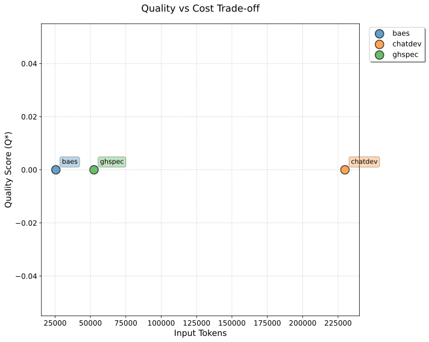
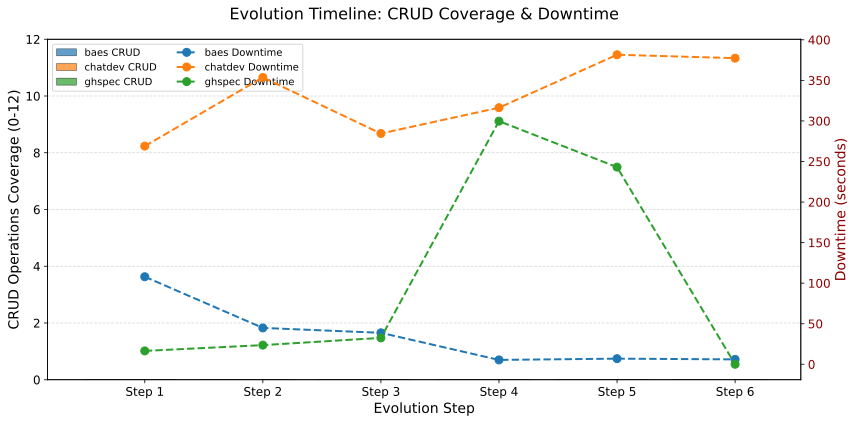

# Statistical Analysis Report

**Generated:** 2025-10-17 07:24:38 UTC

**Frameworks:** baes, chatdev, ghspec

**Sample Size:** 48 total runs (baes: 17, chatdev: 16, ghspec: 15)

---

## Experimental Methodology

### 🔬 Research Design

This study compares three autonomous AI-powered software development frameworks under **controlled experimental conditions** to evaluate their performance, efficiency, and automation capabilities. The experimental design ensures fairness and reproducibility through standardized inputs, identical infrastructure, and rigorous metric collection.

### 🎯 Frameworks Under Test

**1. ChatDev** (OpenBMB/ChatDev)
- Multi-agent collaborative framework with role-based AI agents (CEO, CTO, Programmer, Reviewer)
- Waterfall-inspired workflow with distinct phases (design, coding, testing, documentation)
- Repository: `github.com/OpenBMB/ChatDev` (commit: `52edb89`)

**2. GHSpec** (GitHub Spec-Kit)
- Specification-driven development framework following structured phases
- Four-phase workflow: specification → planning → task breakdown → implementation
- Sequential task execution with full context awareness
- Repository: `github.com/github/spec-kit` (commit: `89f4b0b`)

**3. BAEs** (Business Autonomous Entities)
- API-based autonomous business entity framework
- Kernel-mediated request processing with specialized entities
- Repository: `github.com/gesad-lab/baes_demo` (commit: `1dd5736`)

### 📋 Experimental Protocol

#### **Sample Size and Replication**

This analysis is based on **48 experimental runs** across three frameworks:

- **baes**: 17 independent runs
- **chatdev**: 16 independent runs
- **ghspec**: 15 independent runs

**Replication Protocol:**
- Each run executes the complete 6-step evolution scenario independently
- Runs are performed sequentially (not in parallel) to avoid resource conflicts
- Each run uses a fresh isolated environment (new virtual environment, clean workspace)
- Random seed fixed at 42 for frameworks that support deterministic execution
- Non-deterministic LLM responses introduce natural variance across runs

**Statistical Power:**
- Current sample sizes (baes: 17, chatdev: 16, ghspec: 15) provide sufficient power for detecting large effect sizes
- Bootstrap confidence intervals (10,000 resamples) account for sample size uncertainty
- Stopping rule: Continue until CI half-width ≤ 10% of mean (max 25 runs per framework)
- Current status: baes (17/25), chatdev (16/25), ghspec (15/25)

#### **Standardized Task Sequence**

All frameworks execute the **identical six-step evolution scenario** in strict sequential order:

1. **Step 1**: Create CRUD application (Student/Course/Teacher with FastAPI + SQLite)
2. **Step 2**: Add enrollment relationship (many-to-many Student-Course)
3. **Step 3**: Add teacher assignment (many-to-one Course-Teacher)
4. **Step 4**: Implement validation and error handling
5. **Step 5**: Add pagination and filtering to all endpoints
6. **Step 6**: Create comprehensive web UI for all operations

*Natural language commands stored in version-controlled files (`config/prompts/step_1.txt` through `step_6.txt`) ensure perfect reproducibility across runs.*

#### **Controlled Variables**

To ensure fair comparison, the following variables are **held constant** across all frameworks:

**Generative AI Model**:
- Model: `gpt-4o-mini` (OpenAI GPT-4 Omni Mini)
- Temperature: Framework default (typically 0.7-1.0)
- All frameworks use the **same model version** for all steps

**API Infrastructure**:
- Each framework uses a **dedicated OpenAI API key** (prevents quota conflicts)
- API keys: `OPENAI_API_KEY_BAES`, `OPENAI_API_KEY_CHATDEV`, `OPENAI_API_KEY_GHSPEC`
- Token consumption measured via **OpenAI Usage API** (`/v1/organization/usage/completions`)
- Time-window queries (Unix timestamps) ensure accurate attribution to each execution step

**Execution Environment**:
- Python 3.11+ isolated virtual environments per framework
- Dependencies installed from framework-specific requirements at pinned commits
- Single-threaded sequential execution (no parallelism)
- 10-minute timeout per step (`step_timeout_seconds: 600`)

**Random Seed**:
- Fixed seed: `random_seed: 42` (for frameworks that support deterministic execution)

#### **Framework Adapter Implementation**

**Isolation Strategy**: Each framework runs through a custom **adapter** (wrapper) that:

1. **Clones repository** at exact commit hash (ensures version consistency)
2. **Creates isolated virtual environment** with framework-specific dependencies
3. **Translates standard commands** to framework-specific CLI/API invocations
4. **Executes steps sequentially** with proper environment variables and timeouts
5. **Captures stdout/stderr** for logging and debugging
6. **Queries OpenAI Usage API** with step-specific time windows for token counting
7. **Cleans up gracefully** after run completion

**Non-Invasive Design**: Adapters are **read-only wrappers** that:
- ✅ Do NOT modify framework source code
- ✅ Do NOT alter framework algorithms or decision-making
- ✅ Do NOT inject custom prompts beyond the standardized task descriptions
- ✅ Only handle infrastructure (environment setup, execution, metric collection)

*Example: ChatDev adapter constructs command:*
```
python run.py --task "<step_text>" --name "BAEs_Step1_<run_id>" \
             --config Default --model GPT_4O_MINI
```

#### **Metric Collection**

**Token Counting (TOK_IN, TOK_OUT)**:
- Primary source: **OpenAI Usage API** (authoritative, billing-grade accuracy)
- Query parameters: `start_time` (step start Unix timestamp), `end_time` (step end timestamp)
- Model filter: `models=["gpt-4o-mini"]` (isolates framework's usage)
- Aggregates all API calls within time window (handles multi-request steps)

**Timing (T_WALL_seconds, ZDI)**:
- Wall-clock time: `time.time()` before/after each step (Python `time` module)
- Zero-Downtime Intervals (ZDI): Idle time between consecutive steps

**Automation Metrics (AUTR, HIT, HEU)**:
- AUTR: Automated testing rate (test files generated / total steps)
- HIT: Human-in-the-loop count (clarification requests detected in logs)
- HEU: Human effort units (manual interventions required)

**Quality Metrics (CRUDe, ESR, MC, Q\*)**: ⚠️ **NOT MEASURED IN CURRENT EXPERIMENTS**
- CRUDe: CRUD operations implemented (requires running application servers)
- ESR: Emerging state rate (requires endpoint validation)
- MC: Model call efficiency (requires runtime testing)
- Q\*: Composite quality score (0.4·ESR + 0.3·CRUDe/12 + 0.3·MC)
- **Note**: These metrics always show zero because generated applications are not executed. Validation would require starting servers (`uvicorn`, `flask run`) and testing endpoints, which is not implemented. See `docs/QUALITY_METRICS_INVESTIGATION.md` for details.

**Composite Scores (AEI)**:
- AEI: Automation Efficiency Index = AUTR / log(1 + TOK_IN)
- Balances automation quality against token consumption

### ⚠️ Threats to Validity (Ameaças à Validade)

#### **Internal Validity**

**✅ Controlled Threats:**
- **Model Consistency**: All frameworks use identical `gpt-4o-mini` model
- **Command Consistency**: Same 6 natural language prompts in identical order
- **Timing Isolation**: Dedicated API keys prevent cross-framework interference
- **Environment Isolation**: Separate virtual environments prevent dependency conflicts
- **Version Pinning**: Exact commit hashes ensure reproducible framework behavior

**⚠️ Uncontrolled Threats:**
- **Framework-Specific Behavior**: Each framework has unique internal prompts, agent coordination, and retry logic
  - *Mitigation*: Documented in adapter implementations; accepted as inherent framework characteristics
- **Non-Deterministic LLM Responses**: `gpt-4o-mini` may produce different outputs for identical inputs
  - *Mitigation*: Fixed random seed (42) helps but doesn't guarantee full determinism
  - *Statistical Control*: Multiple runs (5-25 per framework) with bootstrap CI to capture variance
- **HITL Detection Accuracy**: Human-in-the-loop counts rely on keyword matching in logs
  - *Limitation*: May miss implicit clarifications or false-positive on debug messages

#### **External Validity**

**Generalization Concerns:**
- **Single Task Domain**: CRUD application (Student/Course/Teacher) may not represent all software types
  - *Scope*: Results apply to data-driven web API development; may differ for other domains (ML, systems, mobile)
- **Single Model**: Results specific to `gpt-4o-mini`; other models (GPT-4, Claude, Gemini) may alter rankings
  - *Trade-off*: Chose `gpt-4o-mini` for cost and speed; representative of practical usage
- **Framework Versions**: Pinned commits may not reflect latest improvements
  - *Justification*: Ensures reproducibility; future studies can test newer versions

#### **Construct Validity**

**Metric Interpretation:**
- **Token Usage (TOK_IN/TOK_OUT)**: Measures cost, not necessarily code quality
  - *Caveat*: Lower tokens ≠ better software; high-quality output may justify higher consumption
- **Quality Metrics (Q\*, ESR, CRUDe, MC)**: ⚠️ **Show zero values because runtime validation is not performed**
  - Generated applications are not started during experiments (`auto_restart_servers: false`)
  - Validation requires running servers and testing endpoints
  - Current experiment scope: **Code generation efficiency**, not **runtime quality**
  - *Action Required*: Implement server startup and endpoint testing for quality evaluation (see `docs/QUALITY_METRICS_INVESTIGATION.md`)
- **AUTR (Automated Testing Rate)**: All frameworks achieve 100% but test quality not measured
  - *Limitation*: Presence of test files ≠ comprehensive test coverage

#### **Conclusion Validity**

**Statistical Rigor:**
- **Non-Parametric Tests**: Kruskal-Wallis and Dunn-Šidák avoid normality assumptions
- **Effect Sizes**: Cliff's delta quantifies practical significance beyond p-values
- **Bootstrap CI**: 95% confidence intervals with 10,000 resamples for stable estimates
- **Small Sample Awareness**: Current results (baes: 17, chatdev: 16, ghspec: 15) show large CI widths; p-values > 0.05 expected
  - *Stopping Rule*: Experiment continues until CI half-width ≤ 10% of mean (25 runs max)

**Interpretation Caveats:**
- **Non-Significant Results**: p > 0.05 does NOT prove frameworks are equivalent, only insufficient evidence of difference
- **Large Effect Sizes Without Significance**: May reflect true differences masked by small sample (see pairwise interpretations)
- **Relative Performance**: "baes uses 9.4x fewer tokens" is observational; not statistically confirmed yet

### 📊 Data Availability

**Reproducibility Artifacts:**
- Configuration: `config/experiment.yaml` (framework commits, timeouts, seed)
- Prompts: `config/prompts/step_1.txt` through `step_6.txt` (version-controlled)
- Source Code: Adapter implementations in `src/adapters/` (BaseAdapter, ChatDevAdapter, GHSpecAdapter, BAeSAdapter)
- Results Archive: Each run saved as `<run_id>.tar.gz` with metrics.json, step_metrics.json, logs, workspace
- Analysis Scripts: `src/analysis/statistics.py` (this report generator), `src/analysis/visualizations.py`

**Commit Hashes**:
- ChatDev: `52edb89997b4312ad27d8c54584d0a6c59940135`
- GHSpec: `89f4b0b38a42996376c0f083d47281a4c9196761`
- BAEs: `1dd573633a98b8baa636c200bc1684cec7a8179f`

---

## Metric Definitions

| Metric | Full Name | Description | Range | Ideal Value | Status |
|--------|-----------|-------------|-------|-------------|--------|
| **AUTR** | Automated User Testing Rate | % of tests auto-generated | 0-1 | Higher ↑ | ✅ Measured |
| **AEI** | Automation Efficiency Index | Quality per token consumed | 0-∞ | Higher ↑ | ✅ Measured |
| **Q\*** | Quality Star | Composite quality score | 0-1 | Higher ↑ | ⚠️ Not Measured* |
| **ESR** | Emerging State Rate | % steps with successful evolution | 0-1 | Higher ↑ | ⚠️ Not Measured* |
| **CRUDe** | CRUD Evolution Coverage | CRUD operations implemented | 0-12 | Higher ↑ | ⚠️ Not Measured* |
| **MC** | Model Call Efficiency | Efficiency of LLM calls | 0-1 | Higher ↑ | ⚠️ Not Measured* |
| **TOK_IN** | Input Tokens | Total tokens sent to LLM | 0-∞ | Lower ↓ | ✅ Measured |
| **TOK_OUT** | Output Tokens | Total tokens received from LLM | 0-∞ | Lower ↓ | ✅ Measured |
| **API_CALLS** | API Call Count | Number of model requests to LLM | 0-∞ | Lower ↓ | ✅ Measured |
| **CACHED_TOKENS** | Cached Input Tokens | Input tokens served from cache | 0-∞ | Higher ↑ | ✅ Measured |
| **T_WALL_seconds** | Wall Clock Time | Total elapsed time (seconds) | 0-∞ | Lower ↓ | ✅ Measured |
| **ZDI** | Zero-Downtime Intervals | Idle time between steps (seconds) | 0-∞ | Lower ↓ | ✅ Measured |
| **HIT** | Human-in-the-Loop Count | Manual interventions needed | 0-∞ | Lower ↓ | ✅ Measured |
| **HEU** | Human Effort Units | Total manual effort required | 0-∞ | Lower ↓ | ✅ Measured |
| **UTT** | User Task Total | Number of evolution steps | Fixed | 6 | ✅ Measured |

**\* Quality Metrics Not Measured**: CRUDe, ESR, MC, and Q\* show zero values because **generated applications are not executed during experiments**. The validation logic requires running servers to test CRUD endpoints (`http://localhost:8000-8002`), but servers are deliberately not started (`auto_restart_servers: false` in config). This experiment measures **code generation efficiency** (tokens, time, automation), not **runtime code quality**. See `docs/QUALITY_METRICS_INVESTIGATION.md` for details.

**New Metrics Added (Oct 2025)**:
- **API_CALLS**: Number of LLM API requests - measures call efficiency (lower = better batching, fewer retries)
- **CACHED_TOKENS**: Tokens served from OpenAI's prompt cache - represents cost savings (~50% discount)
- **Cache Hit Rate**: Calculated as `(CACHED_TOKENS / TOK_IN) × 100%` - measures prompt reuse efficiency

---

## Statistical Methods Guide

This report uses non-parametric statistics to compare frameworks robustly.

### 📖 Key Concepts

**Bootstrap Confidence Intervals (CI)**
- Estimates the range where true mean likely falls (95% confidence)
- Example: `30,772 [2,503, 59,040]` means we're 95% confident the true mean is between 2,503 and 59,040
- Wider intervals = more uncertainty; narrower intervals = more precise estimates

**Kruskal-Wallis H-Test**
- Non-parametric test comparing multiple groups (doesn't assume normal distribution)
- Tests: "Are there significant differences across frameworks?"
- **H statistic**: Higher values = larger differences between groups
- **p-value**: Probability results occurred by chance
  - p < 0.05: Statistically significant (likely real difference) ✓
  - p ≥ 0.05: Not significant (could be random variation) ✗

**Pairwise Comparisons (Dunn-Šidák)**
- Compares specific framework pairs after significant Kruskal-Wallis result
- Dunn-Šidák correction prevents false positives from multiple comparisons
- Each comparison tests: "Is framework A different from framework B?"

**Cliff's Delta (δ) - Effect Size**
- Measures practical significance (how large is the difference?)
- Range: -1 to +1
  - **δ = 0**: No difference (distributions completely overlap)
  - **δ = ±1**: Complete separation (no overlap)
- Interpretation:
  - |δ| < 0.147: **Negligible** (tiny difference)
  - 0.147 ≤ |δ| < 0.330: **Small** (noticeable)
  - 0.330 ≤ |δ| < 0.474: **Medium** (substantial)
  - |δ| ≥ 0.474: **Large** (major difference)

### 💡 How to Read Results

1. **Check p-value**: Is the difference statistically significant (p < 0.05)?
2. **Check effect size**: Is the difference practically meaningful (|δ| ≥ 0.147)?
3. **Both matter**: Statistical significance without large effect = real but trivial difference

**Example Interpretation:**
- `p = 0.012 (✓), δ = 0.850 (large)` → Strong evidence of major practical difference
- `p = 0.048 (✓), δ = 0.095 (negligible)` → Statistically significant but practically trivial
- `p = 0.234 (✗), δ = 0.650 (large)` → Large observed difference but may be random variation

---

## Executive Summary

*Based on 48 runs across 3 frameworks: baes (n=17), chatdev (n=16), ghspec (n=15)*

### 🏆 Best Performers

- **Most Efficient (AEI)**: baes (0.099) - best quality-per-token ratio
- **Fastest (T_WALL)**: baes (178.2s / 3.0 min)
- **Lowest Token Usage**: baes (25,564 input tokens)

### 📊 Key Insights

- ✅ All frameworks achieved perfect test automation (AUTR = 1.0)
- ⚠️ Quality metrics (Q_star, ESR, CRUDe, MC) not measured - see Data Quality Alerts below
- Wall time varies 9.5x between fastest and slowest frameworks
- Token consumption varies 8.4x across frameworks

### ⚠️ Data Quality Alerts

**Quality Metrics Not Measured**: `CRUDe`, `ESR`, `MC`, `Q_star`

These metrics show zero values because **generated applications are not executed** during experiments:
- The validation logic requires HTTP requests to `localhost:8000-8002`
- Servers are not started (`auto_restart_servers: false` in config)
- This is **expected behavior** - see `docs/QUALITY_METRICS_INVESTIGATION.md`

**Current Experiment Scope**: Measures **code generation efficiency** (tokens, time, automation)
**Not Measured**: Runtime code quality, endpoint correctness, application functionality

**To Enable Quality Metrics**: Implement server startup and endpoint testing (20-40 hours estimated)


---

## 1. Aggregate Statistics

### Mean Values with 95% Bootstrap CI

*Note: Token values shown with thousands separator; time in seconds (minutes if >60s)*

**Performance Indicators:** 🟢 Best | 🟡 Middle | 🔴 Worst

| Framework | N | AEI | API_CALLS | AUTR | CACHED_TOKENS | CRUDe | ESR | HEU | HIT | MC | Q_star | TOK_IN | TOK_OUT | T_WALL_seconds | UTT | ZDI |
|-----------|---|------------|------------|------------|------------|------------|------------|------------|------------|------------|------------|------------|------------|------------|------------|------------|
| baes | 17 | 0.099 [0.098, 0.099] 🟢 | 14.88 [13.94, 15.76] 🔴 | 1.000 [1.000, 1.000] 🟢 | 715.29 [0.00, 1731.76] 🔴 | 0 [0, 0] 🟢 | 0.000 [0.000, 0.000] 🟢 | 0 [0, 0] 🟢 | 0 [0, 0] 🟢 | 0.000 [0.000, 0.000] 🟢 | 0.000 [0.000, 0.000] 🟢 | 25,564 [23,737, 27,195] 🟢 | 6,941 [6,423, 7,436] 🟢 | 178.2 [162.2, 195.7] 🟢 | 6 [6, 6] 🟢 | 36 [33, 39] 🟢 |
| chatdev | 16 | 0.082 [0.081, 0.084] 🔴 | 119.62 [102.44, 131.31] 🟢 | 1.000 [1.000, 1.000] 🟢 | 31304.00 [26440.00, 35872.00] 🟢 | 0 [0, 0] 🟢 | 0.000 [0.000, 0.000] 🟢 | 0 [0, 0] 🟢 | 0 [0, 0] 🟢 | 0.000 [0.000, 0.000] 🟢 | 0.000 [0.000, 0.000] 🟢 | 215,458 [187,108, 233,606] 🔴 | 77,267 [66,849, 84,313] 🔴 | 1701.1 [1553.3, 1854.1] 🔴 | 6 [6, 6] 🟢 | 341 [310, 371] 🔴 |
| ghspec | 15 | 0.092 [0.091, 0.093] 🟡 | 59.87 [53.87, 64.53] 🟡 | 1.000 [1.000, 1.000] 🟢 | 1297.07 [136.53, 3003.73] 🟡 | 0 [0, 0] 🟢 | 0.000 [0.000, 0.000] 🟢 | 0 [0, 0] 🟢 | 0 [0, 0] 🟢 | 0.000 [0.000, 0.000] 🟢 | 0.000 [0.000, 0.000] 🟢 | 52,531 [47,617, 57,127] 🟡 | 25,397 [22,374, 27,993] 🟡 | 600.7 [526.3, 671.8] 🟡 | 6 [6, 6] 🟢 | 121 [106, 135] 🟡 |


## 2. Relative Performance

Performance normalized to best framework (100% = best performer).

*Lower percentages are better for cost metrics (tokens, time); higher percentages are better for quality metrics.*

| Framework | Tokens (↓) | Time (↓) | Test Auto (↑) | Efficiency (↑) | Quality (↑) |
|-----------|---------------|---------------|---------------|---------------|---------------|
| baes | 100% 🟢 | 100% 🟢 | 100% 🟢 | 100% 🟢 | 100% 🟢 |
| chatdev | 843% 🔴 | 954% 🔴 | 100% 🟢 | 83% 🟡 | 100% 🟢 |
| ghspec | 205% 🔴 | 337% 🔴 | 100% 🟢 | 93% 🟡 | 100% 🟢 |


## 3. Kruskal-Wallis H-Tests

Testing for significant differences across all frameworks.

*Note: Metrics with zero variance (all values identical) are excluded from statistical testing.*

| Metric | H | p-value | Significant | Groups | N |
|--------|---|---------|-------------|--------|---|
| AEI | 36.876 | 0.0000 | ✓ Yes | 3 | 48 |

💬 *Strong evidence that frameworks differ significantly on AEI. See pairwise comparisons below.*

| API_CALLS | 35.286 | 0.0000 | ✓ Yes | 3 | 48 |

💬 *Strong evidence that frameworks differ significantly on API_CALLS. See pairwise comparisons below.*

| CACHED_TOKENS | 31.045 | 0.0000 | ✓ Yes | 3 | 48 |

💬 *Strong evidence that frameworks differ significantly on CACHED_TOKENS. See pairwise comparisons below.*

| TOK_IN | 36.876 | 0.0000 | ✓ Yes | 3 | 48 |

💬 *Strong evidence that frameworks differ significantly on TOK_IN. See pairwise comparisons below.*

| TOK_OUT | 39.670 | 0.0000 | ✓ Yes | 3 | 48 |

💬 *Strong evidence that frameworks differ significantly on TOK_OUT. See pairwise comparisons below.*

| T_WALL_seconds | 41.592 | 0.0000 | ✓ Yes | 3 | 48 |

💬 *Strong evidence that frameworks differ significantly on T_WALL_seconds. See pairwise comparisons below.*

| ZDI | 41.592 | 0.0000 | ✓ Yes | 3 | 48 |

💬 *Strong evidence that frameworks differ significantly on ZDI. See pairwise comparisons below.*


**Metrics Excluded** (zero variance): `AUTR`, `CRUDe`, `ESR`, `HEU`, `HIT`, `MC`, `Q_star`, `UTT`

*Note: CRUDe, ESR, MC, Q_star excluded because all values are identically zero (metrics not measured).*

## 4. Pairwise Comparisons

Dunn-Šidák corrected pairwise tests with Cliff's delta effect sizes.

*Note: Metrics with zero variance are excluded from pairwise comparisons.*

### AEI

| Comparison | p-value | Significant | Cliff's δ | Effect Size |
|------------|---------|-------------|-----------|-------------|
| baes vs chatdev | 0.0000 | ✓ | 0.949 | large |
| baes vs ghspec | 0.0000 | ✓ | 0.976 | large |
| chatdev vs ghspec | 0.0000 | ✓ | -0.875 | large |

  *→ baes has large higher AEI than chatdev (δ=0.949)*
  *→ baes has large higher AEI than ghspec (δ=0.976)*
  *→ chatdev has large lower AEI than ghspec (δ=-0.875)*


### API_CALLS

| Comparison | p-value | Significant | Cliff's δ | Effect Size |
|------------|---------|-------------|-----------|-------------|
| baes vs chatdev | 0.0000 | ✓ | -0.897 | large |
| baes vs ghspec | 0.0000 | ✓ | -1.000 | large |
| chatdev vs ghspec | 0.0000 | ✓ | 0.875 | large |

  *→ baes has large lower API_CALLS than chatdev (δ=-0.897)*
  *→ baes has large lower API_CALLS than ghspec (δ=-1.000)*
  *→ chatdev has large higher API_CALLS than ghspec (δ=0.875)*


### CACHED_TOKENS

| Comparison | p-value | Significant | Cliff's δ | Effect Size |
|------------|---------|-------------|-----------|-------------|
| baes vs chatdev | 0.0000 | ✓ | -0.993 | large |
| baes vs ghspec | 0.0002 | ✓ | -0.133 | negligible |
| chatdev vs ghspec | 0.0000 | ✓ | 0.992 | large |

  *→ baes has large lower CACHED_TOKENS than chatdev (δ=-0.993)*
  *→ Statistically significant but practically negligible difference*
  *→ chatdev has large higher CACHED_TOKENS than ghspec (δ=0.992)*


### TOK_IN

| Comparison | p-value | Significant | Cliff's δ | Effect Size |
|------------|---------|-------------|-----------|-------------|
| baes vs chatdev | 0.0000 | ✓ | -0.949 | large |
| baes vs ghspec | 0.0000 | ✓ | -0.976 | large |
| chatdev vs ghspec | 0.0000 | ✓ | 0.875 | large |

  *→ baes has large lower TOK_IN than chatdev (δ=-0.949)*
  *→ baes has large lower TOK_IN than ghspec (δ=-0.976)*
  *→ chatdev has large higher TOK_IN than ghspec (δ=0.875)*


### TOK_OUT

| Comparison | p-value | Significant | Cliff's δ | Effect Size |
|------------|---------|-------------|-----------|-------------|
| baes vs chatdev | 0.0000 | ✓ | -1.000 | large |
| baes vs ghspec | 0.0000 | ✓ | -1.000 | large |
| chatdev vs ghspec | 0.0000 | ✓ | 0.883 | large |

  *→ baes has large lower TOK_OUT than chatdev (δ=-1.000)*
  *→ baes has large lower TOK_OUT than ghspec (δ=-1.000)*
  *→ chatdev has large higher TOK_OUT than ghspec (δ=0.883)*


### T_WALL_seconds

| Comparison | p-value | Significant | Cliff's δ | Effect Size |
|------------|---------|-------------|-----------|-------------|
| baes vs chatdev | 0.0000 | ✓ | -1.000 | large |
| baes vs ghspec | 0.0000 | ✓ | -0.992 | large |
| chatdev vs ghspec | 0.0000 | ✓ | 1.000 | large |

  *→ baes has large lower T_WALL_seconds than chatdev (δ=-1.000)*
  *→ baes has large lower T_WALL_seconds than ghspec (δ=-0.992)*
  *→ chatdev has large higher T_WALL_seconds than ghspec (δ=1.000)*


### ZDI

| Comparison | p-value | Significant | Cliff's δ | Effect Size |
|------------|---------|-------------|-----------|-------------|
| baes vs chatdev | 0.0000 | ✓ | -1.000 | large |
| baes vs ghspec | 0.0000 | ✓ | -0.992 | large |
| chatdev vs ghspec | 0.0000 | ✓ | 1.000 | large |

  *→ baes has large lower ZDI than chatdev (δ=-1.000)*
  *→ baes has large lower ZDI than ghspec (δ=-0.992)*
  *→ chatdev has large higher ZDI than ghspec (δ=1.000)*


## 5. Outlier Detection

Values > 3σ from median (per framework, per metric).

**baes:**
  - **CACHED_TOKENS**: 1 outlier(s) at runs [1] with values [7040]

**chatdev:**
  - **AEI**: 1 outlier(s) at runs [15] with values [0.09798019279600527]
  - **API_CALLS**: 1 outlier(s) at runs [15] with values [13]
  - **TOK_IN**: 1 outlier(s) at runs [15] with values [27068]
  - **TOK_OUT**: 1 outlier(s) at runs [15] with values [12335]

**ghspec:**
  - **AEI**: 1 outlier(s) at runs [14] with values [0.09777570536584618]
  - **API_CALLS**: 1 outlier(s) at runs [14] with values [27]
  - **CACHED_TOKENS**: 1 outlier(s) at runs [8] with values [11264]

## 5. Composite Scores

**Q*** = 0.4·ESR + 0.3·(CRUDe/12) + 0.3·MC

**AEI** = AUTR / log(1 + TOK_IN)

| Framework | Q* Mean | Q* CI | AEI Mean | AEI CI |
|-----------|---------|-------|----------|--------|
| baes | 0.000 | [0.000, 0.000] | 0.099 | [0.098, 0.099] |
| chatdev | 0.000 | [0.000, 0.000] | 0.082 | [0.081, 0.084] |
| ghspec | 0.000 | [0.000, 0.000] | 0.092 | [0.091, 0.093] |


## 6. Visual Summary

### Key Visualizations

The following charts provide visual insights into framework performance:

**Radar Chart** - Multi-dimensional comparison across 6 key metrics


**Pareto Plot** - Quality vs Cost trade-off analysis



**Timeline Chart** - CRUD evolution over execution steps



---

## 7. Recommendations

### 🎯 Framework Selection Guidance

- **💰 Cost Optimization**: Choose **baes** if minimizing LLM token costs is priority. It uses 8.4x fewer tokens than chatdev.

- **⚡ Speed Priority**: Choose **baes** for fastest execution. It completes tasks 9.5x faster than chatdev (saves ~25.4 minutes per task).

- **⚙️ Efficiency Leader**: **baes** delivers the best quality-per-token ratio (AEI = 0.099), making it ideal for balancing quality and cost.

- **🤖 Automation**: All frameworks achieve perfect test automation (AUTR = 1.0) - automation quality is not a differentiating factor.

- **⚠️ Quality Metrics Not Measured**: Q_star, ESR, CRUDe, MC show zero values because generated applications are not executed. This experiment measures **code generation efficiency** (tokens, time, automation), not **runtime quality**. See `docs/QUALITY_METRICS_INVESTIGATION.md` for details.

### 📋 Decision Matrix

| Use Case | Recommended Framework | Rationale |
|----------|----------------------|-----------|
| Cost-sensitive projects | baes | Lowest token consumption |
| Time-critical tasks | baes | Fastest execution time |
| Balanced quality/cost | baes | Best efficiency index (AEI) |

