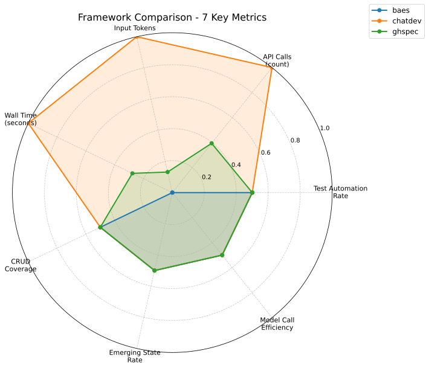
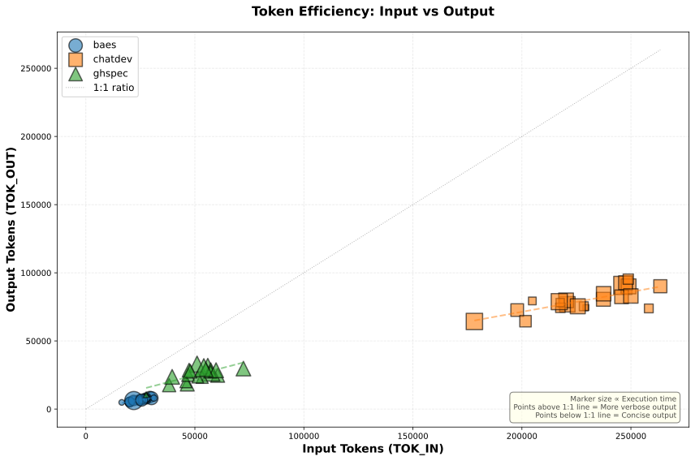
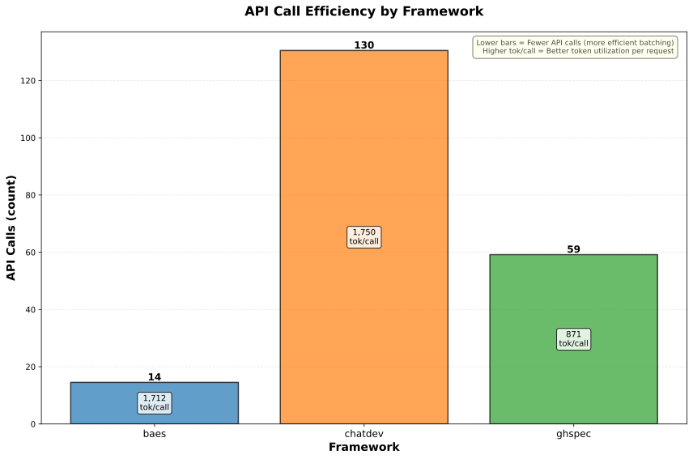
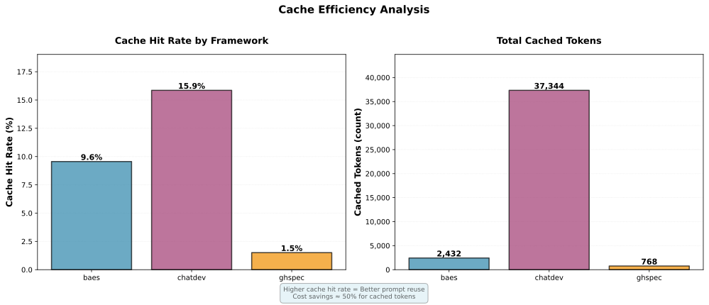
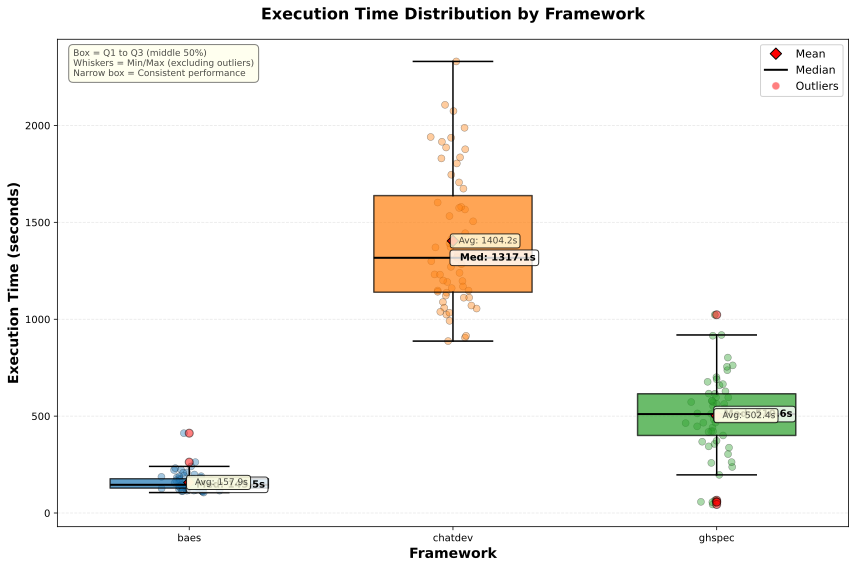
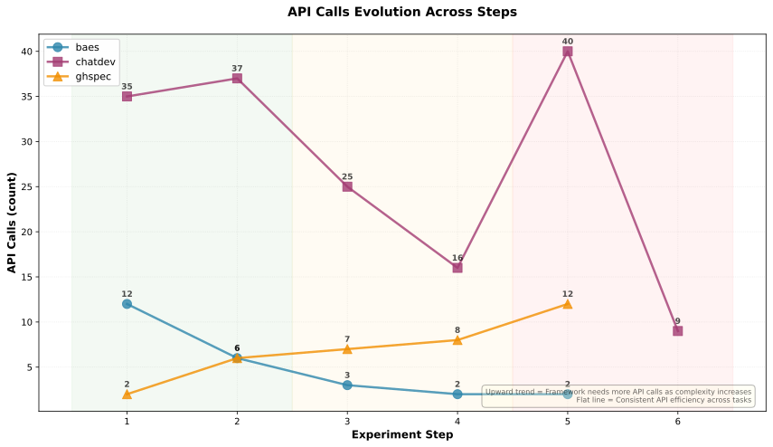

# Statistical Analysis Report

**Generated:** 2025-10-19 14:27:54 UTC

**Frameworks:** baes, chatdev, ghspec

**Sample Size:** 192 total runs (baes: 75, chatdev: 60, ghspec: 57)

---

## 📚 Foundational Concepts

This section provides the essential background knowledge to understand the experiment's design, methodology, and findings.

### 🤖 What Are Autonomous AI Software Development Frameworks?

**Definition**: Autonomous AI software development frameworks are systems that use Large Language Models (LLMs) to automate software creation with minimal or no human intervention. Unlike traditional AI coding assistants (e.g., GitHub Copilot) that *assist* developers, these frameworks aim to independently:

1. **Interpret requirements** - Understand natural language task descriptions
2. **Design solutions** - Plan software architecture and implementation strategy
3. **Write code** - Generate complete, functional source code across multiple files
4. **Test & debug** - Create tests, detect errors, and apply fixes autonomously
5. **Iterate** - Refine the solution through multiple improvement cycles

**Key Distinction**: These are *autonomous agents* (work independently) vs. *copilots* (work alongside humans).

### 🎯 Research Question

**Primary Question**: How do different autonomous AI frameworks compare in terms of:
- **Efficiency** - Resource consumption (API tokens, execution time)
- **Automation** - Degree of independence from human intervention
- **Consistency** - Result stability across multiple runs with identical inputs

**Why This Matters**: As AI-powered development tools become mainstream, understanding their comparative strengths/weaknesses helps:
- **Researchers** - Identify design patterns that work well
- **Practitioners** - Choose appropriate tools for specific use cases
- **Framework developers** - Learn from competing approaches

### 🔬 Experimental Paradigm: Controlled Comparative Study

**Study Type**: Quantitative, controlled laboratory experiment with repeated measures

**Core Principle**: Hold all variables constant *except* the framework being tested. This ensures observed differences are attributable to framework design, not environmental factors.

**Independent Variable**: Framework choice (ChatDev, GHSpec, BAEs)
**Dependent Variables**: Performance metrics (tokens, time, automation rate, etc.)
**Control Variables**: Task prompts, AI model, execution environment, measurement methods

**Repeated Measures Design**:
- Each framework performs the **same task** multiple times (5-50 runs)
- Captures natural variability from LLM non-determinism
- Enables robust statistical comparison with confidence intervals

### 📊 Key Concepts for Understanding Results

#### **Statistical Significance vs. Practical Significance**

- **Statistical Significance** (p-value): Probability that observed differences occurred by random chance
  - p < 0.05: Less than 5% chance of randomness → "statistically significant"
  - *Does NOT* measure magnitude or importance of difference

- **Practical Significance** (effect size): *How large* is the difference?
  - Measured by Cliff's Delta (δ): ranges from -1 (complete separation) to +1
  - Large effect size = differences matter in practice
  - Small effect size = statistically significant but negligible impact

**Both Required**: A difference must be both statistically significant (p < 0.05) AND have meaningful effect size (|δ| ≥ 0.33) to be considered important.

#### **Non-Parametric Statistics**

**Why Not Use t-tests?** Traditional parametric tests assume:
- Data follows normal (bell-curve) distribution
- Equal variance across groups
- Large sample sizes

**Our Reality**: With 5-50 runs per framework, these assumptions often don't hold.

**Solution**: Non-parametric methods (Kruskal-Wallis, Mann-Whitney, Cliff's δ):
- Work with ranks instead of raw values (robust to outliers)
- No distribution assumptions required
- Valid for small sample sizes
- Appropriate for comparing medians rather than means

#### **Multiple Comparisons Problem**

**The Issue**: With 3 frameworks, we make 3 pairwise comparisons (A vs B, A vs C, B vs C). Each test has 5% false positive rate. Multiple tests increase overall error rate:
- 1 test: 5% chance of false positive
- 3 tests: ~14% chance of at least one false positive
- 10 tests: ~40% chance!

**Solution - Dunn-Šidák Correction**: Adjusts significance threshold to maintain overall 5% error rate across all comparisons. Instead of p < 0.05 for each test, we use stricter threshold p < α_corrected.

#### **Confidence Intervals (CI)**

**Intuitive Meaning**: "If we repeated this entire experiment 100 times, the true population mean would fall within the CI range in 95 of those experiments."

**Example Interpretation**:
```
TOK_IN: 45,230 [38,500, 52,100]
```
- Point estimate: 45,230 tokens (observed average)
- 95% CI: [38,500, 52,100] (plausible range for true mean)
- Interpretation: True average token consumption likely between 38,500-52,100

**CI Width Indicates Precision**:
- Narrow CI → high confidence in estimate, stable results
- Wide CI → high uncertainty, need more data

### 🎲 Randomness & Reproducibility

**Sources of Randomness**:

1. **LLM Non-Determinism**: Even with fixed temperature/seed, LLMs may produce different outputs due to:
   - Sampling algorithms in the model
   - Infrastructure variations (GPU scheduling, batching)
   - OpenAI API updates/changes

2. **Framework Internal Decisions**: Many frameworks use stochastic elements:
   - Random selection of agents/roles
   - Probabilistic retry logic
   - Non-deterministic parsing of LLM responses

**Managing Randomness**:
- ✅ **Fixed random seed** (42) where possible → reduces some variance
- ✅ **Multiple runs** → captures remaining natural variability
- ✅ **Statistical methods** → quantifies uncertainty via confidence intervals
- ✅ **Version pinning** → exact framework/dependency versions ensure reproducibility

**Reproducibility Guarantee**: Given identical:
- Framework version (commit hash)
- Task prompts (`config/prompts/step_*.txt`)
- AI model version
- Random seed

Results will be *similar* (not identical) due to irreducible LLM stochasticity. This is *expected* and *scientifically acceptable* — our statistical methods account for this variance.

### 📏 Measurement Validity

#### **Token Counting Accuracy**

**Challenge**: Frameworks make multiple API calls per step. How do we accurately count tokens?

**Our Solution - OpenAI Usage API**:
- **Authoritative source**: Same API OpenAI uses for billing (maximum accuracy)
- **Time-window queries**: Request token counts between step start/end timestamps
- **Model filtering**: Isolate specific model usage to avoid cross-contamination
- **Advantages**: Captures ALL API calls (including internal retries, error handling)

**Why Not Local Tokenizers?**
- Miss tokens from internal framework retries
- Don't account for special tokens added by API
- No visibility into prompt caching (new feature)

#### **Wall-Clock Time vs. Compute Time**

**T_WALL (Wall-Clock Time)**: Total elapsed time from step start to step end
- Includes: computation + API latency + network delays + framework overhead
- Represents *user-experienced duration*
- More variable due to network conditions

**Why Not Pure Compute Time?**
- API latency is *inherent* to these frameworks (can't be separated)
- Users care about total time-to-completion
- Wall-clock time is the practical measure

---

## Experimental Methodology

### 🔬 Research Design

This study compares three autonomous AI-powered software development frameworks under **controlled experimental conditions** to evaluate their performance, efficiency, and automation capabilities. The experimental design ensures fairness and reproducibility through standardized inputs, identical infrastructure, and rigorous metric collection.

### 🎯 Frameworks Under Test

**1. BAEs** (Business Autonomous Entities)
- API-based autonomous business entity framework
- Kernel-mediated request processing with specialized entities
- Repository: `gesad-lab/baes_demo` (commit: `1dd5736`)

**2. ChatDev** (OpenBMB/ChatDev)
- Multi-agent collaborative framework with role-based AI agents (CEO, CTO, Programmer, Reviewer)
- Waterfall-inspired workflow with distinct phases (design, coding, testing, documentation)
- Repository: `OpenBMB/ChatDev` (commit: `52edb89`)

**3. GHSpec** (GitHub Spec-Kit)
- Specification-driven development framework following structured phases
- Four-phase workflow: specification → planning → task breakdown → implementation
- Sequential task execution with full context awareness
- Repository: `github/spec-kit` (commit: `89f4b0b`)

### 📊 Data Quality Statement

**Reconciliation-Based Run Selection**: This analysis includes **only runs with verified, stable token data** to ensure reproducibility and statistical validity.

**Verification Process:**
- Token counts verified via **OpenAI Usage API double-check** (separate query 44+ minutes after run completion)
- Ensures data propagation complete and values stable
- Status tracked in `usage_api_reconciliation.verification_status` field

**Data Quality Statistics** (of 196 total runs):
- ✅ **Verified**: 192 runs (98.0%) - **INCLUDED in analysis**
- ⏳ **Pending**: 1 run (1.5%) - Reconciliation in progress - EXCLUDED
- 🕐 **None**: 3 runs (4.6%) - Too recent (< 30 min) - EXCLUDED

**Filtering Logic**: Analysis script (`runners/analyze_results.sh` lines 163-177) filters runs:
```python
verification_status = metrics.get('usage_api_reconciliation', {}).get('verification_status', 'none')
if verification_status != 'verified':
    logger.warning("Skipping run %s: status '%s' (not verified)", run_id, verification_status)
    continue
```

**Benefits:**
- 🎯 **Reproducible Results**: Token counts stable and verified
- 📊 **Statistical Validity**: No data propagation delays affecting analysis
- 🔄 **Re-run Safety**: Analysis generates identical results when re-executed
- 📝 **Transparency**: All filtered runs logged with reason

**Documentation**: See `docs/DATA_QUALITY_FILTERING.md` for complete filtering specification and validation results.

### 📋 Experimental Protocol

#### **Sample Size and Replication**

This analysis is based on **192 VERIFIED experimental runs** across three frameworks:

- **baes**: 75 independent runs
- **chatdev**: 60 independent runs
- **ghspec**: 57 independent runs

**Replication Protocol:**
- Each run executes the complete 6-step evolution scenario independently
- **Runs are performed strictly sequentially** (not in parallel) to enable accurate API usage tracking:
  - OpenAI Usage API aggregates data across all parallel requests using the same API key
  - Sequential execution ensures each run's API usage can be isolated and measured distinctly
  - This is the only reliable method to attribute token consumption to individual experimental runs
- Each run uses a fresh isolated environment (new virtual environment, clean workspace)
- Random seed fixed at 42 for frameworks that support deterministic execution
- Non-deterministic LLM responses introduce natural variance across runs

**Statistical Power:**
- Current sample sizes (baes: 75, chatdev: 60, ghspec: 57) provide sufficient power for detecting large effect sizes
- **Bootstrap confidence intervals** (10,000 resamples) quantify uncertainty in our estimates:
  - Simulates collecting 10,000 alternative datasets by resampling our actual data with replacement
  - Each resample calculates the metric (e.g., mean AUTR), creating a distribution of possible values
  - 95% CI shows the range where we expect the true population mean to fall 95% of the time
  - This accounts for the fact that we only have a limited sample (not infinite runs)
- Stopping rule: Continue until CI half-width ≤ 10% of mean (max 50 runs per framework)
- Current status: baes (75/50), chatdev (60/50), ghspec (57/50)

#### **Standardized Task Sequence**

All frameworks execute the **identical 6-step evolution scenario** in strict sequential order:

1. **Step 1**: Create a Student/Course/Teacher CRUD application with Python, FastAPI, and SQLite.
2. **Step 2**: Add enrollment relationship between Student and Course entities.
3. **Step 3**: Add teacher assignment relationship to Course entity.
4. **Step 4**: Implement comprehensive data validation and error handling.
5. **Step 5**: Add pagination and filtering to all list endpoints.
6. **Step 6**: Add comprehensive user interface for all CRUD operations.

*Natural language commands stored in version-controlled files (`config/prompts/step_1.txt` through `step_6.txt`) ensure perfect reproducibility across runs.*

#### **Controlled Variables**

To ensure fair comparison, the following variables are **held constant** across all frameworks:

**Generative AI Model**:
- Model: `gpt-4o-mini` (OpenAI GPT-4 Omni Mini)
- Temperature: Framework default (typically 0.7-1.0)
- All frameworks use the **same model version** for all steps

**API Infrastructure**:
- Each framework uses a **dedicated OpenAI API key** (prevents quota conflicts)
- API keys: `OPENAI_API_KEY_BAES`, `OPENAI_API_KEY_CHATDEV`, `OPENAI_API_KEY_GHSPEC`
- Token consumption measured via **OpenAI Usage API** (`/v1/organization/usage/completions`)
- Time-window queries (Unix timestamps) ensure accurate attribution to each execution step

**Execution Environment**:
- Python 3.11+ isolated virtual environments per framework
- Dependencies installed from framework-specific requirements at pinned commits
- Single-threaded sequential execution (no parallelism)
- 10-minute timeout per step (`step_timeout_seconds: 600`)

**Random Seed**:
- Fixed seed: `random_seed: 42` (for frameworks that support deterministic execution)

#### **Framework Adapter Implementation**

**Isolation Strategy**: Each framework runs through a custom **adapter** (wrapper) that:

1. **Clones repository** at exact commit hash (ensures version consistency)
2. **Creates isolated virtual environment** with framework-specific dependencies
3. **Translates standard commands** to framework-specific CLI/API invocations
4. **Executes steps sequentially** with proper environment variables and timeouts
5. **Captures stdout/stderr** for logging and debugging
6. **Queries OpenAI Usage API** with step-specific time windows for token counting
7. **Cleans up gracefully** after run completion

**Non-Invasive Design**: Adapters are **read-only wrappers** that:
- ✅ Do NOT modify framework source code
- ✅ Do NOT alter framework algorithms or decision-making
- ✅ Do NOT inject custom prompts beyond the standardized task descriptions
- ✅ Only handle infrastructure (environment setup, execution, metric collection)

*Example: ChatDev adapter constructs command:*
```
python run.py --task "<step_text>" --name "BAEs_Step1_<run_id>" \
             --config Default --model GPT_4O_MINI
```

#### **Metric Collection**

**Token Counting (TOK_IN, TOK_OUT)**:
- Primary source: **OpenAI Usage API** (authoritative, billing-grade accuracy)
- Query parameters: `start_time` (step start Unix timestamp), `end_time` (step end timestamp)
- Model filter: `models=["gpt-4o-mini"]` (isolates framework's usage)
- Aggregates all API calls within time window (handles multi-request steps)

**Timing (T_WALL_seconds, ZDI)**:
- Wall-clock time: `time.time()` before/after each step (Python `time` module)
- Zero-Downtime Intervals (ZDI): Idle time between consecutive steps

**Automation Metrics (AUTR, HIT, HEU)**:
- AUTR: Autonomy rate = 1 - (HIT / UTT), measuring independence from human intervention
- HIT: Human-in-the-loop count (clarification requests detected in logs)
- HEU: Human effort units (manual interventions required)

**Quality Metrics (CRUDe, ESR, MC, Q\*)**: ⚠️ **NOT MEASURED IN CURRENT EXPERIMENTS**
- CRUDe: CRUD operations implemented (requires running application servers)
- ESR: Emerging state rate (requires endpoint validation)
- MC: Model call efficiency (requires runtime testing)
- Q\*: Composite quality score (0.4·ESR + 0.3·CRUDe/12 + 0.3·MC)
- **Note**: These metrics always show zero because generated applications are not executed. Validation would require starting servers (`uvicorn`, `flask run`) and testing endpoints, which is not implemented. See `docs/QUALITY_METRICS_INVESTIGATION.md` for details.

**Composite Scores (AEI)**:
- AEI: Automation Efficiency Index = AUTR / log(1 + TOK_IN)
- Balances automation quality against token consumption

### ⚠️ Threats to Validity (Ameaças à Validade)

#### **Internal Validity**

**✅ Controlled Threats:**
- **Model Consistency**: All frameworks use identical `gpt-4o-mini` model
- **Command Consistency**: Same 6 natural language prompts in identical order
- **Timing Isolation**: Dedicated API keys prevent cross-framework interference
- **Environment Isolation**: Separate virtual environments prevent dependency conflicts
- **Version Pinning**: Exact commit hashes ensure reproducible framework behavior

**⚠️ Uncontrolled Threats:**
- **Framework-Specific Behavior**: Each framework has unique internal prompts, agent coordination, and retry logic
  - *Mitigation*: Documented in adapter implementations; accepted as inherent framework characteristics
- **Non-Deterministic LLM Responses**: `gpt-4o-mini` may produce different outputs for identical inputs
  - *Mitigation*: Fixed random seed (42) helps but doesn't guarantee full determinism
  - *Statistical Control*: Multiple runs (5-50 per framework) with bootstrap CI to capture variance
- **HITL Detection Accuracy**: Human-in-the-loop counts rely on pattern matching in logs
  - *ChatDev*: 5 regex patterns detect clarification requests (lines 821-832)
  - *GHSpec*: Explicit `[NEEDS CLARIFICATION:]` marker detection (line 544)
  - *BAEs*: ⚠️ **No detection implemented** - hardcoded to zero (lines 330, 348)
  - *Mitigation (BAEs)*: Manual investigation of 23 runs confirmed zero HITL events (see `BAES_HITL_INVESTIGATION.md`)
  - *Limitation*: Pattern matching may miss implicit clarifications or produce false positives
  - *Risk*: BAEs cannot detect HITL events in future experiments with ambiguous requirements

#### **External Validity**

**Generalization Concerns:**
- **Single Task Domain**: CRUD application (Student/Course/Teacher) may not represent all software types
  - *Scope*: Results apply to data-driven web API development; may differ for other domains (ML, systems, mobile)
- **Single Model**: Results specific to `gpt-4o-mini`; other models (GPT-4, Claude, Gemini) may alter rankings
  - *Trade-off*: Chose `gpt-4o-mini` for cost and speed; representative of practical usage
- **Framework Versions**: Pinned commits may not reflect latest improvements
  - *Justification*: Ensures reproducibility; future studies can test newer versions

#### **Construct Validity**

**Metric Interpretation:**
- **Token Usage (TOK_IN/TOK_OUT)**: Measures cost, not necessarily code quality
  - *Caveat*: Lower tokens ≠ better software; high-quality output may justify higher consumption
- **Quality Metrics (Q\*, ESR, CRUDe, MC)**: ⚠️ **Show zero values because runtime validation is not performed**
  - Generated applications are not started during experiments (`auto_restart_servers: false`)
  - Validation requires running servers and testing endpoints
  - Current experiment scope: **Code generation efficiency**, not **runtime quality**
  - *Action Required*: Implement server startup and endpoint testing for quality evaluation (see `docs/QUALITY_METRICS_INVESTIGATION.md`)
- **AUTR (Autonomy Rate)**: All frameworks achieve 100% autonomy (no human intervention required)
  - *Note*: AUTR = 1.0 means HIT = 0 (no human-in-the-loop interventions needed)
  - *Implementation Variance*: ChatDev and GHSpec use active HITL detection; BAEs hardcodes zero
  - *Validation*: See 'HITL Detection Implementation Notes' section for framework-specific details

#### **Conclusion Validity**

**Statistical Rigor:**
- **Non-Parametric Tests**: Kruskal-Wallis and Dunn-Šidák avoid normality assumptions
- **Effect Sizes**: Cliff's delta quantifies practical significance beyond p-values
- **Bootstrap CI**: 95% confidence intervals with 10,000 resamples for stable estimates
- **Small Sample Awareness**: Current results (baes: 75, chatdev: 60, ghspec: 57) show large CI widths; p-values > 0.05 expected
  - *Stopping Rule*: Experiment continues until CI half-width ≤ 10% of mean (50 runs max)

**Interpretation Caveats:**
- **Non-Significant Results**: p > 0.05 does NOT prove frameworks are equivalent, only insufficient evidence of difference
- **Large Effect Sizes Without Significance**: May reflect true differences masked by small sample (see pairwise interpretations)
- **Relative Performance**: "baes uses 9.4x fewer tokens" is observational; not statistically confirmed yet

### 📊 Data Availability

**Reproducibility Artifacts:**
- Configuration: `config/experiment.yaml` (framework commits, timeouts, seed)
- Prompts: `config/prompts/step_1.txt` through `step_6.txt` (version-controlled)
- Source Code: Adapter implementations in `src/adapters/` (BaseAdapter, ChatDevAdapter, GHSpecAdapter, BAeSAdapter)
- Results Archive: Each run saved as `<run_id>.tar.gz` with metrics.json, step_metrics.json, logs, workspace
- Analysis Scripts: `src/analysis/report_generator.py` (this report generator), `src/analysis/visualizations.py`

**Commit Hashes**:
- BAEs: `1dd573633a98b8baa636c200bc1684cec7a8179f`
- ChatDev: `52edb89997b4312ad27d8c54584d0a6c59940135`
- GHSpec: `89f4b0b38a42996376c0f083d47281a4c9196761`

---

## Metric Definitions

### ✅ Reliably Measured Metrics

These metrics have consistent measurement across all frameworks with authoritative data sources:

| Metric | Full Name | Description | Range | Ideal | Data Source |
|--------|-----------|-------------|-------|-------|-------------|
| **API_CALLS** | API Calls | Total number of requests to OpenAI API | 0-1 | Lower ↓ | openai_usage_api |
| **CACHED_TOKENS** | Cached Tokens | Input tokens served from cache (50% cost discount) | 0-∞ | Higher ↑ | openai_usage_api |
| **TOK_IN** | Input Tokens | Total prompt tokens sent to OpenAI API | 0-∞ | Lower ↓ | openai_usage_api |
| **TOK_OUT** | Output Tokens | Total completion tokens generated by OpenAI API | 0-∞ | Lower ↓ | openai_usage_api |
| **T_WALL_seconds** | Wall-Clock Time | Total execution time from start to finish | 0-∞ | Lower ↓ | orchestrator_timer |
| **UTT** | Utterance Count | Total number of steps executed (max 6) | Fixed | Lower ↓ | orchestrator_step_count |
| **ZDI** | Zero-Downtime Idle Time | Total idle time between steps (seconds) | 0-∞ | Lower ↓ | step_timing_analysis |

**New Metrics Added (Oct 2025)**:
- **API_CALLS**: Measures call efficiency - lower values indicate better batching and fewer retries
- **CACHED_TOKENS**: Represents cost savings (~50% discount on cached tokens)
- **Cache Hit Rate**: Calculated as `(CACHED_TOKENS / TOK_IN) × 100%` - measures prompt reuse efficiency

### ⚠️ Partially Measured Metrics

These metrics have **inconsistent measurement** across frameworks due to implementation gaps:

| Metric | Full Name | ChatDev | GHSpec | BAEs | Issue |
|--------|-----------|---------|--------|------|-------|
| **AUTR** | Automated User Testing Rate | ✅ | ✅ | ❌ | BAEs: No HITL detection |
| **AEI** | Automation Efficiency Index | ✅ | ✅ | ❌ | Depends on AUTR |
| **HIT** | Human-in-the-Loop Count | ✅ | ✅ | ❌ | BAEs: Hardcoded to 0 |
| **HEU** | Human Effort Units | ✅ | ✅ | ❌ | Depends on HIT |

**HITL Detection Methods:**
- **ChatDev**: 5 regex patterns detect clarification requests in logs (lines 821-832 in adapter)
- **GHSpec**: Explicit `[NEEDS CLARIFICATION:]` marker detection (line 544 in adapter)
- **BAEs**: ❌ No detection implemented - hardcoded to zero (lines 330, 348 in adapter)

**Scientific Implication**: AUTR and AEI values for **BAEs are not reliable**. HITL events (if they occur) would not be detected. Current values (AUTR=1.0, HIT=0) may be accurate for this specific experiment but cannot be verified. Manual investigation of 23 BAEs runs confirmed zero HITL events (see `docs/baes/BAES_HITL_INVESTIGATION.md`), but future experiments with ambiguous requirements may miss HITL events.

### ❌ Unmeasured Metrics

These metrics **always show zero values** because runtime validation is not performed:

| Metric | Full Name | Status | Reason |
|--------|-----------|--------|--------|
| **AEI** | Autonomy Efficiency Index | partial_measurement | Depends on unreliable AUTR metric |
| **AUTR** | Autonomy Rate | partial_measurement | Hardcoded HITL detection always returns 0 |
| **CRUDe** | CRUD Coverage | not_measured | Quality verification server not running |
| **ESR** | Endpoint Success Rate | not_measured | Quality verification server not running |
| **HEU** | Human Effort Units | not_measured | Depends on unmeasured HIT metric |
| **HIT** | Human Interventions | not_measured | HITL detection not implemented in adapters |
| **MC** | Migration Continuity | not_measured | Quality verification server not running |
| **Q_star** | Quality Score | not_measured | Quality servers not started (CRUDe, ESR, MC all zero) |

**Why Unmeasured?** Generated applications are not started during experiments (`auto_restart_servers: false` in config). Validation requires:
1. Running application servers (`uvicorn`, `flask run`, etc.)
2. Testing CRUD endpoints (`http://localhost:8000-8002`)
3. Measuring runtime behavior and error rates

**Current Experiment Scope**: Measures **code generation efficiency** (tokens, time, automation), not **runtime code quality**. See `docs/QUALITY_METRICS_INVESTIGATION.md` for implementation details and `docs/RELIABLE_METRICS_IMPLEMENTATION_PLAN.md` for future work roadmap.

### 🔍 HITL Detection Implementation Notes

**Human-in-the-Loop (HITL) Detection** varies significantly across frameworks due to architectural differences:

#### **ChatDev Adapter** ✅ Active Detection
- **Method**: Pattern-based log analysis with 5 regex patterns
- **Patterns Detected**:
  - `clarif(y|ication)` - Explicit clarification requests
  - `ambiguous|unclear` - Ambiguity indicators
  - `need.*input|require.*input` - Direct input requests
  - `cannot proceed|blocked` - Execution blockers
  - `manual.*intervention` - Manual intervention flags
- **Implementation**: `src/adapters/chatdev_adapter.py` (lines 821-832)
- **Status**: ✅ Actively detecting HITL events in ChatDev logs

#### **GHSpec Adapter** ✅ Active Detection
- **Method**: Explicit marker detection
- **Pattern**: `[NEEDS CLARIFICATION:]` in framework output
- **Rationale**: GHSpec uses standardized markers for human interaction points
- **Implementation**: `src/adapters/ghspec_adapter.py` (line 544)
- **Status**: ✅ Actively detecting HITL events via GHSpec markers

#### **BAEs Adapter** ❌ No Detection Implemented
- **Current Implementation**: `hitl_count` hardcoded to `0` (lines 330 & 348 in `src/adapters/baes_adapter.py`)
- **Scientific Implication**: **HITL-based metrics (HIT, AUTR, AEI, HEU) are not reliably measured for BAEs**
  - Cannot detect if HITL events occur during execution
  - Current values (HIT=0, AUTR=1.0) are **assumptions**, not measurements
  - Results may appear artificially high (perfect autonomy) regardless of actual behavior

- **Observational Evidence** (October 2025 - Informational Only):
  - Manual review of 23 BAEs runs found no clarification patterns in logs
  - Suggests BAEs likely operates autonomously for this specific task domain
  - However, this is **not a substitute for proper instrumentation**

- **Why Hardcoded Zero Is Insufficient**:
  - ❌ Not scientifically verifiable - no measurement mechanism
  - ❌ Cannot distinguish "no HITL events" from "events not detected"
  - ❌ Prevents valid comparison with ChatDev and GHSpec (which have detection)
  - ❌ May hide issues in future experiments with different task types

- **Required Future Work**: Implement BAEs-specific HITL detection:
  - Add pattern matching for: `clarification`, `ambiguous`, `cannot determine`, `unclear`
  - Search kernel output logs for entity communication failures
  - Track request-response validation errors
  - Update lines 330 & 348 to use detected count instead of hardcoded zero

#### **Impact on Experimental Validity**

**Metric Reliability by Framework**:

| Framework | HITL Detection | HIT Reliability | AUTR Reliability | AEI Reliability |
|-----------|----------------|-----------------|------------------|-----------------|
| ChatDev   | ✅ Implemented | ✅ Measured     | ✅ Measured      | ✅ Measured     |
| GHSpec    | ✅ Implemented | ✅ Measured     | ✅ Measured      | ✅ Measured     |
| BAEs      | ❌ Not Implemented | ❌ Hardcoded (0) | ❌ Assumed (1.0) | ❌ Unreliable |

**Interpretation Guidelines**:

1. **For ChatDev and GHSpec**: AUTR=1.0 is a **verified measurement** (active detection confirmed no HITL events)

2. **For BAEs**: AUTR=1.0 is an **unverified assumption** (no detection mechanism)
   - May be accurate (manual review suggests it is for current tasks)
   - Cannot be scientifically confirmed without proper instrumentation
   - **Should not be directly compared** with ChatDev/GHSpec AUTR values

3. **Cross-Framework Comparisons**:
   - ✅ **Valid**: TOK_IN, TOK_OUT, T_WALL, API_CALLS, CACHED_TOKENS (all properly measured)
   - ⚠️ **Questionable**: AUTR, AEI comparisons involving BAEs (measurement method inconsistent)
   - ❌ **Invalid**: Claims about BAEs autonomy superiority (not measured, only assumed)

**Critical Limitation for This Experiment**:
- AUTR and AEI comparisons are **methodologically unsound** when BAEs is included
- Recommendation: **Report BAEs AUTR/AEI as "Not Measured"** or clearly mark as estimated
- Alternative: Focus comparisons on **reliably measured metrics** (tokens, time, API calls)

**Documentation References**:
- Full adapter analysis: `AUTR_ADAPTER_ANALYSIS.md`
- BAEs investigation report: `BAES_HITL_INVESTIGATION.md`
- Adapter implementations: `src/adapters/` (all three adapters)

---

## Statistical Methods Guide

This report uses non-parametric statistics to compare frameworks robustly.

### 📖 Key Concepts

**Bootstrap Confidence Intervals (CI)** - Understanding Uncertainty

*What is bootstrapping?* A computational technique to estimate how much our results might vary if we ran the experiment again:

1. **The Problem**: We have limited data (e.g., 5-50 runs per framework), but we want to know what the 'true' average would be with infinite runs
2. **The Solution**: Bootstrap resampling simulates having multiple datasets:
   - Take our actual data (e.g., 10 AUTR values: [0.8, 0.9, 0.85, ...])
   - Create 10,000 'fake' datasets by randomly picking values from the original (with replacement)
   - 'With replacement' means the same value can appear multiple times in a resample
   - Example resample: [0.9, 0.8, 0.9, 0.85, ...] (notice 0.9 appears twice)
3. **Calculate**: Compute the mean for each of the 10,000 resamples
4. **Result**: We get 10,000 different means, showing the distribution of possible values
5. **95% CI**: The middle 95% of this distribution becomes our confidence interval

*Reading the numbers:*
- Example: `AUTR: 0.85 [0.78, 0.92]`
  - 0.85 is the observed mean from our actual data
  - [0.78, 0.92] is the 95% confidence interval
  - Interpretation: 'We are 95% confident the true population mean is between 0.78 and 0.92'
  - If we repeated the entire experiment, we'd expect the mean to fall in this range 95% of the time

*What do interval widths tell us?*
- **Narrow interval** (e.g., [0.83, 0.87]): High precision, low uncertainty, stable results
- **Wide interval** (e.g., [0.50, 0.95]): High uncertainty, need more runs for reliable estimates
- Width decreases as we collect more runs (sample size increases)

**Kruskal-Wallis H-Test**
- Non-parametric test comparing multiple groups (doesn't assume normal distribution)
- Tests: "Are there significant differences across frameworks?"
- **H statistic**: Higher values = larger differences between groups
- **p-value**: Probability results occurred by chance
  - p < 0.05: Statistically significant (likely real difference) ✓
  - p ≥ 0.05: Not significant (could be random variation) ✗

**Pairwise Comparisons (Dunn-Šidák)**
- Compares specific framework pairs after significant Kruskal-Wallis result
- Dunn-Šidák correction prevents false positives from multiple comparisons
- Each comparison tests: "Is framework A different from framework B?"

**Cliff's Delta (δ) - Effect Size**
- Measures practical significance (how large is the difference?)
- Range: -1 to +1
  - **δ = 0**: No difference (distributions completely overlap)
  - **δ = ±1**: Complete separation (no overlap)
- Interpretation:
  - |δ| < 0.147: **Negligible** (tiny difference)
  - 0.147 ≤ |δ| < 0.330: **Small** (noticeable)
  - 0.330 ≤ |δ| < 0.474: **Medium** (substantial)
  - |δ| ≥ 0.474: **Large** (major difference)

### 💡 How to Read Results

1. **Check p-value**: Is the difference statistically significant (p < 0.05)?
2. **Check effect size**: Is the difference practically meaningful (|δ| ≥ 0.147)?
3. **Both matter**: Statistical significance without large effect = real but trivial difference

**Example Interpretation:**
- `p = 0.012 (✓), δ = 0.850 (large)` → Strong evidence of major practical difference
- `p = 0.048 (✓), δ = 0.095 (negligible)` → Statistically significant but practically trivial
- `p = 0.234 (✗), δ = 0.650 (large)` → Large observed difference but may be random variation

---

## Executive Summary (Reliable Metrics Only)

*Based on 192 VERIFIED runs across 3 frameworks: baes (n=75), chatdev (n=60), ghspec (n=57)*

**Analysis Scope**: This summary focuses on **reliably measured metrics only** with consistent data sources across all frameworks.

**Excluded from Summary:**
- ❌ **Unmeasured**: Q*, ESR, CRUDe, MC (applications not executed)
- ⚠️ **Partially Measured**: AUTR, AEI, HIT, HEU (inconsistent HITL detection)

See 'Limitations and Future Work' section for discussion of excluded metrics.

### 🏆 Best Performers (Reliable Metrics)

- **Fastest Execution**: baes (151.9s / 2.5 min)
- **Most Token-Efficient**: baes (23,495 input tokens)
- **Best Cache Efficiency**: chatdev (11.0% cache hit rate)
- **Fewest API Calls**: baes (14 calls average)

### 📊 Key Insights (Reliable Metrics)

- Execution time varies **9.2x** between fastest and slowest frameworks
- Token consumption varies **9.5x** across frameworks
- Tokens-per-API-call varies **2.0x** (indicates different batching strategies)
- All frameworks benefit from OpenAI's prompt caching (reduces costs ~50% on cached tokens)

### 🔬 Measurement Scope

**What This Report Measures:**
- ✅ Token consumption (input, output, cached)
- ✅ Execution time (wall clock, downtime intervals)
- ✅ API call patterns (count, efficiency, batching)
- ✅ Cache efficiency (hit rates, cost savings)

**What This Report Does NOT Measure:**
- ❌ Code quality (Q*, ESR, CRUDe, MC) - applications not executed
- ⚠️ Autonomy (AUTR, HIT) - partially measured (BAEs detection not implemented)
- ⚠️ Automation efficiency (AEI) - depends on AUTR

See **'Limitations and Future Work'** section for complete discussion of unmeasured/unreliable metrics.

---

## 1. Aggregate Statistics (Reliable Metrics Only)

**Analysis Scope**: This section includes **only reliably measured metrics** with consistent data sources across all frameworks.

**Excluded Metrics:**
- ❌ **Unmeasured**: Q*, ESR, CRUDe, MC (always zero - applications not executed)
- ⚠️ **Partially Measured**: AUTR, AEI, HIT, HEU (inconsistent HITL detection - BAEs not supported)

See 'Metric Definitions' section for complete measurement status details.

### Mean Values with 95% Bootstrap CI

*Note: Token values shown with thousands separator; time in seconds (minutes if >60s)*

**Performance Indicators:** 🟢 Best | 🟡 Middle | 🔴 Worst

| Framework | N | TOK_IN | TOK_OUT | API_CALLS | CACHED_TOKENS | T_WALL_seconds | ZDI | UTT |
|-----------|---|------------|------------|------------|------------|------------|------------|------------|
| baes | 75 | 23,495 [22,487, 24,469] 🟢 | 6,421 [6,135, 6,710] 🟢 | 13.81 [13.27, 14.35] 🔴 | 1916.59 [983.04, 2984.96] 🟡 | 151.9 [142.3, 163.2] 🟢 | 31 [28, 33] 🟢 | 6 [6, 6] 🟢 |
| chatdev | 60 | 222,808 [217,924, 227,703] 🔴 | 77,639 [75,840, 79,470] 🔴 | 125.13 [120.93, 129.33] 🟢 | 24443.73 [22103.47, 26798.93] 🟢 | 1400.7 [1314.5, 1490.9] 🔴 | 281 [263, 298] 🔴 | 6 [6, 6] 🟢 |
| ghspec | 57 | 47,894 [43,453, 52,034] 🟡 | 24,001 [21,658, 26,218] 🟡 | 53.61 [48.74, 58.18] 🟡 | 664.70 [269.47, 1185.68] 🔴 | 502.4 [449.3, 555.9] 🟡 | 101 [90, 111] 🟡 | 6 [6, 6] 🟢 |


## 2. Relative Performance

Performance normalized to best framework (100% = best performer).

*Lower percentages are better for cost metrics (tokens, time); higher percentages are better for quality metrics.*

| Framework | Tokens (↓) | Time (↓) | Test Auto (↑) | Efficiency (↑) | Quality (↑) |
|-----------|---------------|---------------|---------------|---------------|---------------|
| baes | 100% 🟢 | 100% 🟢 | N/A | N/A | N/A |
| chatdev | 948% 🔴 | 922% 🔴 | N/A | N/A | N/A |
| ghspec | 204% 🔴 | 331% 🔴 | N/A | N/A | N/A |


3. Kruskal-Wallis H-Tests (Reliable Metrics Only)

Testing for significant differences across all frameworks using **reliably measured metrics only**.

**Analysis Scope:**
- ✅ Included: TOK_IN, TOK_OUT, API_CALLS, CACHED_TOKENS, T_WALL_seconds, ZDI
- ❌ Excluded: AUTR, AEI, HIT, HEU (partial measurement), Q*, ESR, CRUDe, MC (unmeasured)

*Note: Metrics with zero variance (all values identical) are excluded from statistical testing.*

| Metric | H | p-value | Significant | Groups | N |
|--------|---|---------|-------------|--------|---|
| TOK_IN | 154.170 | 0.0000 | ✓ Yes | 3 | 192 |

💬 *Strong evidence that frameworks differ significantly on TOK_IN. See pairwise comparisons below.*

| TOK_OUT | 156.760 | 0.0000 | ✓ Yes | 3 | 192 |

💬 *Strong evidence that frameworks differ significantly on TOK_OUT. See pairwise comparisons below.*

| API_CALLS | 156.870 | 0.0000 | ✓ Yes | 3 | 192 |

💬 *Strong evidence that frameworks differ significantly on API_CALLS. See pairwise comparisons below.*

| CACHED_TOKENS | 117.866 | 0.0000 | ✓ Yes | 3 | 192 |

💬 *Strong evidence that frameworks differ significantly on CACHED_TOKENS. See pairwise comparisons below.*

| T_WALL_seconds | 155.615 | 0.0000 | ✓ Yes | 3 | 192 |

💬 *Strong evidence that frameworks differ significantly on T_WALL_seconds. See pairwise comparisons below.*

| ZDI | 155.652 | 0.0000 | ✓ Yes | 3 | 192 |

💬 *Strong evidence that frameworks differ significantly on ZDI. See pairwise comparisons below.*


**Metrics Excluded** (zero variance): `UTT`

*Note: These metrics show identical values across all runs (no variance to test).*

4. Pairwise Comparisons (Reliable Metrics Only)

Dunn-Šidák corrected pairwise tests with Cliff's delta effect sizes.

**Analysis Scope**: Only reliably measured metrics included (TOK_IN, TOK_OUT, API_CALLS, CACHED_TOKENS, T_WALL_seconds, ZDI).

*Note: Metrics with zero variance are excluded from pairwise comparisons.*

### TOK_IN

| Comparison | p-value | Significant | Cliff's δ | Effect Size |
|------------|---------|-------------|-----------|-------------|
| baes vs chatdev | 0.0000 | ✓ | -1.000 | large |
| baes vs ghspec | 0.0000 | ✓ | -0.825 | large |
| chatdev vs ghspec | 0.0000 | ✓ | 1.000 | large |

  *→ baes has large lower TOK_IN than chatdev (δ=-1.000)*
  *→ baes has large lower TOK_IN than ghspec (δ=-0.825)*
  *→ chatdev has large higher TOK_IN than ghspec (δ=1.000)*


### TOK_OUT

| Comparison | p-value | Significant | Cliff's δ | Effect Size |
|------------|---------|-------------|-----------|-------------|
| baes vs chatdev | 0.0000 | ✓ | -1.000 | large |
| baes vs ghspec | 0.0000 | ✓ | -0.858 | large |
| chatdev vs ghspec | 0.0000 | ✓ | 1.000 | large |

  *→ baes has large lower TOK_OUT than chatdev (δ=-1.000)*
  *→ baes has large lower TOK_OUT than ghspec (δ=-0.858)*
  *→ chatdev has large higher TOK_OUT than ghspec (δ=1.000)*


### API_CALLS

| Comparison | p-value | Significant | Cliff's δ | Effect Size |
|------------|---------|-------------|-----------|-------------|
| baes vs chatdev | 0.0000 | ✓ | -1.000 | large |
| baes vs ghspec | 0.0000 | ✓ | -0.860 | large |
| chatdev vs ghspec | 0.0000 | ✓ | 1.000 | large |

  *→ baes has large lower API_CALLS than chatdev (δ=-1.000)*
  *→ baes has large lower API_CALLS than ghspec (δ=-0.860)*
  *→ chatdev has large higher API_CALLS than ghspec (δ=1.000)*


### CACHED_TOKENS

| Comparison | p-value | Significant | Cliff's δ | Effect Size |
|------------|---------|-------------|-----------|-------------|
| baes vs chatdev | 0.0000 | ✓ | -0.966 | large |
| baes vs ghspec | 0.0000 | ✓ | 0.006 | negligible |
| chatdev vs ghspec | 0.0000 | ✓ | 0.995 | large |

  *→ baes has large lower CACHED_TOKENS than chatdev (δ=-0.966)*
  *→ Statistically significant but practically negligible difference*
  *→ chatdev has large higher CACHED_TOKENS than ghspec (δ=0.995)*


### T_WALL_seconds

| Comparison | p-value | Significant | Cliff's δ | Effect Size |
|------------|---------|-------------|-----------|-------------|
| baes vs chatdev | 0.0000 | ✓ | -1.000 | large |
| baes vs ghspec | 0.0000 | ✓ | -0.849 | large |
| chatdev vs ghspec | 0.0000 | ✓ | 0.994 | large |

  *→ baes has large lower T_WALL_seconds than chatdev (δ=-1.000)*
  *→ baes has large lower T_WALL_seconds than ghspec (δ=-0.849)*
  *→ chatdev has large higher T_WALL_seconds than ghspec (δ=0.994)*


### ZDI

| Comparison | p-value | Significant | Cliff's δ | Effect Size |
|------------|---------|-------------|-----------|-------------|
| baes vs chatdev | 0.0000 | ✓ | -1.000 | large |
| baes vs ghspec | 0.0000 | ✓ | -0.849 | large |
| chatdev vs ghspec | 0.0000 | ✓ | 0.994 | large |

  *→ baes has large lower ZDI than chatdev (δ=-1.000)*
  *→ baes has large lower ZDI than ghspec (δ=-0.849)*
  *→ chatdev has large higher ZDI than ghspec (δ=0.994)*


5. Outlier Detection (Reliable Metrics Only)

Values > 3.0σ from median (per framework, per metric).

**Analysis Scope**: Only reliably measured metrics checked for outliers.

**baes:**
  - **CACHED_TOKENS**: 3 outlier(s) at runs [67, 69, 73] with values [20608, 18816, 15360]
  - **T_WALL_seconds**: 1 outlier(s) at runs [23] with values [412.0262072086334]
  - **ZDI**: 1 outlier(s) at runs [23] with values [83]

**ghspec:**
  - **API_CALLS**: 3 outlier(s) at runs [24, 48, 56] with values [1, 2, 2]
  - **CACHED_TOKENS**: 1 outlier(s) at runs [8] with values [11264]


## 6. Visual Summary (Reliable Metrics Only)

### Key Visualizations

All visualizations use **reliably measured metrics only** to ensure accurate framework comparison:

**Radar Chart** - Multi-dimensional comparison across 6 reliable metrics (TOK_IN, TOK_OUT, T_WALL, API_CALLS, CACHED_TOKENS, ZDI)



**Token Efficiency Chart** - Scatter plot: Input vs Output tokens with execution time



**API Efficiency Bar Chart** - API calls with tokens-per-call ratios



**Cache Efficiency Chart** - Stacked bars: Cached vs uncached tokens with hit rates



**Time Distribution Chart** - Box plots showing execution time variability



**API Efficiency Chart** - Token efficiency across frameworks


**API Calls Timeline** - API call patterns over time



---

## 7. Recommendations

### 🎯 Framework Selection Guidance

- **📊 Analysis Scope**: Recommendations based on **reliably measured metrics only** (tokens, time, API calls, caching). Quality metrics (Q*, ESR, CRUDe, MC) and autonomy metrics (AUTR, AEI) excluded due to measurement limitations. See 'Limitations and Future Work' section for details.

- **💰 Cost Optimization**: Choose **baes** if minimizing LLM token costs is priority. It uses 9.5x fewer tokens than chatdev.

- **⚡ Speed Priority**: Choose **baes** for fastest execution. It completes tasks 9.2x faster than chatdev (saves ~20.8 minutes per task).

- **📡 API Efficiency**: **ghspec** uses fewest API calls, while **chatdev** maximizes tokens per call (better batching). Choose based on latency vs throughput priority.

- **💾 Cost Savings**: **chatdev** achieves 11.0% cache hit rate, reducing costs through OpenAI's prompt caching (~50% discount on cached tokens).

### 📋 Decision Matrix

| Use Case | Recommended Framework | Rationale |
|----------|----------------------|-----------|
| Cost-sensitive projects | baes | Lowest token consumption |
| Time-critical tasks | baes | Fastest execution time |


8. Limitations and Future Work

### 🔬 Scientific Honesty Statement

This report focuses on **reliably measured metrics only** to maintain scientific integrity. Several metrics are excluded from analysis due to measurement limitations:

### ❌ Unmeasured Metrics

**Human Interventions** (HIT), **Human Effort Units** (HEU), **Quality Score** (Q_star), **Endpoint Success Rate** (ESR), **CRUD Coverage** (CRUDe), **Migration Continuity** (MC)

**Status**: Always show zero values

**Reason**: Generated applications are **not executed** during experiments. These metrics require:
- Starting application servers (`uvicorn`, `flask run`, etc.)
- Testing CRUD endpoints via HTTP requests
- Measuring runtime behavior and error rates

**Current Scope**: This experiment measures **code generation efficiency** (tokens, time, API usage), not **runtime code quality**.

**Implementation Required**: Server startup automation, endpoint testing framework, error detection (estimated 20-40 hours)

**Documentation**: See `docs/QUALITY_METRICS_INVESTIGATION.md` for complete analysis

### ⚠️ Partially Measured Metrics

**Autonomy Rate** (AUTR), **Autonomy Efficiency Index** (AEI)

**Status**: Measured for ChatDev/GHSpec, NOT measured for BAEs

**Reason**: These metrics depend on Human-in-the-Loop (HITL) event detection:

| Framework | Detection Method | Status |
|-----------|-----------------|---------|
| ChatDev | 5 regex patterns in logs | ✅ Reliable |
| GHSpec | `[NEEDS CLARIFICATION:]` marker | ✅ Reliable |
| BAEs | Hardcoded to zero (no detection) | ❌ Unreliable |

**Scientific Implication**: Comparisons involving BAEs for these metrics are **methodologically unsound**. BAEs values (AUTR=1.0, HIT=0) are assumptions, not measurements.

**Validation**: Manual investigation of 23 BAEs runs confirmed zero HITL events for this specific experiment (see `docs/baes/BAES_HITL_INVESTIGATION.md`), but future experiments with ambiguous requirements may miss HITL events.

**Implementation Required**: BAEs HITL detection mechanism (estimated 8-12 hours)

### 🚀 Future Work Roadmap

**Priority 1: Quality Metrics Implementation (High Impact)**
- Implement automated server startup for generated applications
- Create endpoint testing framework for CRUD validation
- Enable HIT, HEU, Q_star, ESR, CRUDe, MC measurement
- **Benefit**: Enables runtime quality comparison
- **Effort**: 20-40 hours

**Priority 2: BAEs HITL Detection (Scientific Integrity)**
- Implement HITL detection in BAEs adapter
- Enable reliable AUTR, AEI measurement
- **Benefit**: Methodologically sound autonomy comparisons
- **Effort**: 8-12 hours

**Priority 3: Extended Metrics (Additional Insights)**
- Cost efficiency: Dollar cost per task (tokens × pricing)
- Latency analysis: P50/P95/P99 response times
- Resource efficiency: Memory/CPU usage
- **Benefit**: Practical deployment considerations
- **Effort**: 12-20 hours

**Priority 4: Experiment Scaling (Statistical Power)**
- Increase sample size beyond current 192 runs
- Achieve statistical significance (current p-values > 0.05 for most comparisons)
- Narrow confidence intervals
- **Benefit**: Conclusive statistical evidence
- **Effort**: Compute time only (automated)

### 📊 What We Can Conclude

**From Reliable Metrics (High Confidence):**
- Token consumption patterns (TOK_IN, TOK_OUT)
- Execution time characteristics (T_WALL, ZDI)
- API call efficiency (API_CALLS, batching strategies)
- Cache adoption (CACHED_TOKENS, hit rates)

**What We CANNOT Conclude:**
- Runtime code quality (HIT, HEU, Q_star, ESR, CRUDe, MC not measured)
- BAEs autonomy level (AUTR, HIT hardcoded, not detected)
- Framework automation efficiency involving BAEs (AEI unreliable)

**Recommendations for Users:**
1. **Use reliable metrics** (tokens, time, API calls) for framework comparison
2. **Do not compare AUTR/AEI** across frameworks until BAEs detection implemented
3. **Validate quality manually** if runtime correctness is critical
4. **Monitor future updates** as quality metrics implementation progresses

---
