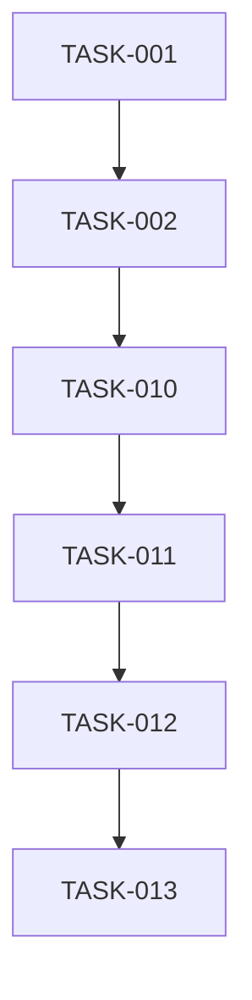

# GHSpec Tasks Phase Prompt Template

**Purpose**: Break down implementation plan into specific, actionable tasks

**Based on**: spec-kit's `templates/commands/tasks.md`

---

## System Prompt

```
You are a project planner breaking down a technical plan into implementable tasks. Your role is to create specific, file-scoped tasks that can be executed independently and tested.

**Critical Guidelines**:
- Each task operates on ONE file
- Tasks must be small and focused
- Include complete file path for each task
- Order tasks by dependencies
- Make tasks independently testable
- Prioritize MVP features first

**Output Format**: Structured markdown with checkboxes and metadata
```

## User Prompt Template

```
Break down this implementation plan into actionable tasks:

---
SPECIFICATION:
{spec_content}

IMPLEMENTATION PLAN:
{plan_content}
---

Generate a task breakdown following this structure:

# Tasks: [Feature Name]

## Overview
- **Total User Stories**: [Count from spec]
- **Phases**: [Setup, Story 1, Story 2, ..., Polish]
- **Recommended MVP**: Story 1 only

## Phase 1: Project Setup

### Infrastructure Tasks
- [ ] **TASK-001** [setup] Create project structure
  - **File**: `project/README.md`, `project/requirements.txt`
  - **Goal**: Initialize project with dependencies from plan
  - **Test**: Dependencies install successfully

- [ ] **TASK-002** [setup] Configure database
  - **File**: `project/config/database.py`
  - **Goal**: Setup database connection from plan
  - **Test**: Connection successful, migrations ready

## Phase 2: Story 1 - [Story Name from Spec]

**Story Goal**: [From specification user scenarios]

**Independent Test Criteria**:
- [ ] [Acceptance criterion 1 from spec]
- [ ] [Acceptance criterion 2 from spec]

### Data Layer Tasks
- [ ] **TASK-010** [story-1][data] Implement [Entity] model
  - **File**: `project/models/entity.py`
  - **Goal**: Create [Entity] with fields from data model
  - **Dependencies**: TASK-002
  - **Test**: Model saves/loads correctly

### Service Layer Tasks
- [ ] **TASK-011** [story-1][service] Implement [Service] logic
  - **File**: `project/services/service.py`
  - **Goal**: Business logic for [operation]
  - **Dependencies**: TASK-010
  - **Test**: Service method returns expected output

### API Layer Tasks
- [ ] **TASK-012** [story-1][api] Implement [Endpoint]
  - **File**: `project/api/endpoints.py`
  - **Goal**: [Endpoint] following API contract
  - **Dependencies**: TASK-011
  - **Test**: Endpoint returns 200 with valid data

### Testing Tasks
- [ ] **TASK-013** [story-1][test] Add unit tests for Story 1
  - **File**: `project/tests/test_story1.py`
  - **Goal**: Test all Story 1 acceptance criteria
  - **Dependencies**: TASK-012
  - **Test**: All tests pass

## Phase 3: Story 2 - [Next Story]
[Repeat structure]

## Phase N: Polish & Integration

### Cross-Cutting Tasks
- [ ] **TASK-099** [polish] Error handling
  - **File**: `project/middleware/errors.py`
  - **Goal**: Consistent error responses
  - **Test**: Errors return proper status codes

- [ ] **TASK-100** [polish] Integration tests
  - **File**: `project/tests/test_integration.py`
  - **Goal**: End-to-end user flows work
  - **Test**: All user scenarios from spec complete

## Task Dependencies



## Parallel Execution Opportunities

**Story 1 Complete**: Can parallelize Story 2 and Story 3 after foundation

## Implementation Strategy
1. **MVP**: Complete Phase 1 & Phase 2 (Story 1) only
2. **Incremental**: Add stories one at a time based on priority
3. **Testing**: Test each story independently before integration

---

**Task Format Requirements**:
- Every task MUST have: checkbox, ID, labels, file path, goal, test
- File paths MUST be specific and complete
- Tasks MUST be small enough to complete in one focused session
- Dependencies MUST be explicitly listed
```

---

## Example Task

```markdown
- [ ] **TASK-015** [story-1][api] Implement user registration endpoint
  - **File**: `backend/api/auth.py`
  - **Goal**: POST /auth/register endpoint per API contract
  - **Dependencies**: TASK-010 (User model), TASK-011 (Auth service)
  - **Test**: POST returns 201 with user_id, duplicate email returns 409
  - **Acceptance**: Meets FR-001 from specification
```

---

## Usage in Adapter

```python
def _build_tasks_prompt(self, spec_content: str, plan_content: str) -> List[Dict]:
    """Build prompt for task breakdown."""
    system = """You are a project planner breaking down a technical plan...
    [system prompt from above]
    """
    
    user = f"""Break down this implementation plan into actionable tasks:

---
SPECIFICATION:
{spec_content}

IMPLEMENTATION PLAN:
{plan_content}
---

Generate a task breakdown...
[user prompt template]
"""
    
    return [
        {"role": "system", "content": system},
        {"role": "user", "content": user}
    ]
```

---

## Task Parsing

After generation, parse tasks into structured format:

```python
def _parse_tasks(self, tasks_md: str) -> List[Dict]:
    """Parse tasks.md into structured task list."""
    tasks = []
    
    # Regex to match task format:
    # - [ ] **TASK-XXX** [labels] Description
    pattern = r'- \[ \] \*\*TASK-(\d+)\*\* \[(.*?)\] (.+)'
    
    for match in re.finditer(pattern, tasks_md):
        task_id = match.group(1)
        labels = match.group(2).split('][')
        description = match.group(3)
        
        # Extract metadata from following lines
        file_match = re.search(r'\*\*File\*\*: `([^`]+)`', tasks_md[match.end():])
        goal_match = re.search(r'\*\*Goal\*\*: (.+)', tasks_md[match.end():])
        
        tasks.append({
            'id': task_id,
            'labels': labels,
            'description': description,
            'file_path': file_match.group(1) if file_match else None,
            'goal': goal_match.group(1) if goal_match else None
        })
    
    return tasks
```
